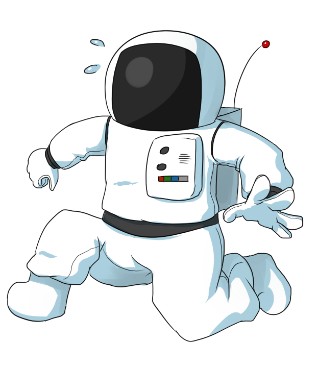

<div align="center">

# Project Zenith



**A cinematic, real-time space intelligence platform.**

Track every satellite. Explore every planet. Know everything above you — from any point on Earth.

<br/>

[](https://nextjs.org/)
[](https://www.typescriptlang.org/)
[](https://react.dev/)
[](https://tailwindcss.com/)
[](https://cesium.com/)
[](https://threejs.org/)
[](https://www.framer.com/motion/)
[](./LICENSE)

<br/>

### 🌐 [Explore the Platform → zenith-the-celestial-eye.netlify.app](https://zenith-the-celestial-eye.netlify.app/)

### 📦 [View Source on GitHub → KANDURU-SUDHEER/Zenith](https://github.com/KANDURU-SUDHEER/Zenith)

<br/>

</div>


## Overview

Project Zenith is a full-stack space intelligence platform built with Next.js 16, React 19, and CesiumJS. It turns any location on Earth into a personal space observatory — in real time.

Select any point on the interactive 3D globe and Zenith instantly calculates:

- Every satellite currently overhead from a live catalogue of **8,000+ objects**
- The exact position, altitude, velocity, and orbital path of the **ISS**
- Every **planet, star, and constellation** visible from your coordinates at the current time
- **72-hour visibility predictions** for every tracked object
- Live **NASA imagery**, precise astronomical data, and AI-powered explanations

Traditional space-tracking tools provide fragments. Zenith provides a unified, cinematic, real-time picture.

---

## How Zenith Works

Every observation session flows through a deterministic 8-step pipeline — from raw location input to exported mission report.

```
  USER SELECTS LOCATION
  ─────────────────────
  Click globe · Search city · Use GPS
  Observer lat / lon / timezone stored in location store
         │
         ▼
  TLE DATA FETCH
  ──────────────
  Two-Line Element sets for 8,000+ satellites pulled from CelesTrak
  Bundled snapshot used as offline fallback
  Cached via TanStack Query — auto-revalidated every few hours
         │
         ▼
  SGP4 ORBITAL PROPAGATION
  ─────────────────────────
  satellite.js runs the SGP4/SDP4 model against every TLE
  at the current simulated timestamp
  Produces live latitude, longitude, altitude, and velocity
  Runs on a 4-second update cycle
         │
         ▼
  VISIBILITY ENGINE
  ─────────────────
  Converts each satellite's ECEF position into topocentric
  azimuth and elevation relative to the observer point
  Geographic bounding-box pre-filter eliminates ~65% of
  satellites before the full look-angle computation runs
  Objects with elevation > 0° are marked above the horizon
         │
         ▼
  CELESTIAL ENGINE
  ────────────────
  astronomy-engine calculates Sun, Moon, and all 8 planet
  positions for the observer at the simulated time
  Outputs azimuth, elevation, magnitude, rise/set/transit
  times, constellation membership, and lunar phase data
         │
         ▼
  RENDERING LAYER
  ───────────────
  Globe        — CesiumJS renders satellite dots by category,
                 ISS orbital path, cloud overlay, click-to-select
  Radar        — Canvas polar plot: azimuth/elevation with sweep
                 arm, 3D planet spheres, satellite dots, labels
  Solar System — Three.js orrery: moons, rings, zoom, rotation
  All three views consume the same propagated dataset
         │
         ▼
  AI SKY GUIDE
  ────────────
  Observer context injected into every Gemini prompt:
  location, visible planets, ISS position, moon phase,
  sun elevation, selected satellite
  Responses stream token-by-token via Server-Sent Events
  Falls back to curated static responses if Gemini is unavailable
         │
         ▼
  MISSION REPORT
  ──────────────
  All session data aggregated: satellite statistics, ISS pass
  prediction, planet positions, moon data, constellation list
  Exported as a formatted PDF via pdfmake or as CSV
  Radar canvas screenshot optionally embedded in PDF
```

## Features

### Landing Page

A fully cinematic, scroll-driven experience engineered to showcase the platform before a single interaction. Every frame is intentional.

#### Sections

| Section | Description |
|---|---|
| Hero | Full-viewport animated hero with parallax 3D Earth, procedural star field, meteor layer, floating astronaut, rocket fly-bys, and satellite fly-bys. Scroll-driven transitions via Framer Motion. |
| Orbital Tracking | Animated canvas globe with live orbital paths and a telemetry ticker showing real satellite data. |
| Sky Radar | Animated radar canvas demonstrating real-time azimuth/elevation tracking. |
| Solar System | Live orrery preview — all 8 planets orbiting with accurate relative periods. |
| NASA APOD | Rotating showcase of NASA Astronomy Pictures with canvas scene renderings. |
| Mission Intelligence | Platform overview with an animated hub showing all 7 core modules. |
| Why Zenith | Side-by-side comparison of traditional tools versus Zenith's unified approach. |
| Final CTA | Animated orbital ring with launch button. |
| Footer | Responsive multi-column footer with navigation anchors. |

#### Visual Effects

| Effect | Implementation |
|---|---|
| Procedural star field | Multi-layer canvas particle system — stars at varying sizes, opacities, and depths to simulate parallax distance |
| Nebula rendering | Radial gradient compositing on canvas to produce soft, colour-shifted nebula clouds behind the star layers |
| Mouse parallax | `mousemove` listener drives independent X/Y offsets per layer — foreground objects shift faster than background stars |
| Floating astronaut | CSS transform animation with subtle rotation and vertical drift; reacts to scroll position |
| Rocket fly-bys | Canvas-animated rocket traversals timed to scroll progress milestones |
| Satellite fly-bys | Lightweight canvas dots following curved Bézier paths across the viewport |
| Earth atmosphere | Radial glow composited over the globe sphere to simulate atmospheric scattering |
| Day/night Earth | Real-time terminator line driven by the current Sun azimuth/elevation |
| City lights | Night-side texture overlay that fades in as the terminator crosses a region |
| Meteors | Short-lived streak particles with randomised angle, speed, and tail length |
| Scroll animations | Framer Motion `useScroll` + `useTransform` hooks bind opacity, scale, and Y-position to scroll progress |
| Scroll-triggered reveals | `IntersectionObserver` triggers `animate` variants on section entry |
| Glassmorphism | `backdrop-filter: blur()` with semi-transparent backgrounds and subtle border highlights |
| Gradient lighting | Layered CSS radial gradients that shift hue and intensity per section theme |
| Premium typography | `clamp()`-based fluid type scale from 320px to 3840px; variable font weights per heading level |

#### Performance

- 6 canvas-based animations, each paused via `IntersectionObserver` when scrolled off-screen — zero GPU cost for hidden sections
- `requestAnimationFrame` loops cancelled on component unmount
- Decorative objects hidden on mobile (`< 768px`) to reduce GPU load
- Framer Motion `LazyMotion` with `domAnimation` feature bundle — tree-shakes unused animation primitives
- `will-change: transform` applied only to actively animating elements; removed after transitions complete

---


### Dashboard

The core application — a multi-panel command center for real-time space observation at `/zenith`.

#### Layout & Panels

| Component | Description |
|---|---|
| View switcher | Globe, Radar, Solar System, APOD with instant transitions; WebGL context preserved across switches |
| Left sidebar | Satellite category filters, favorites, recent searches, AI Sky Guide entry point — collapsible on tablet and below |
| Right details panel | ISS telemetry, planet positions, moon phase, constellations, selected satellite data — collapsible independently |
| Header | Status bar, live badge, simulation controls, search trigger, and quick-action buttons |

#### Panel Behaviour

- **Draggable panels** — detail cards within the dashboard can be repositioned to suit workflow preference
- **Collapsible sidebars** — left and right panels collapse independently with animated transitions; state persisted across sessions
- **Responsive layout** — fluid from 320px to 3840px; panels stack vertically on mobile and float on desktop
- **Persistent state** — sidebar open/closed state, active view, and filter selections survive page reload via `localStorage`
- **Keyboard shortcuts** — `Ctrl+K` global search · `Ctrl+Shift+E` mission report · `Ctrl+Shift+R` radar focus
- **Quick actions** — header toolbar buttons for refresh, location reset, lighting toggle, cloud overlay, and Go Live

---

### Simulation Engine

A fully controllable time machine for the entire solar system. Every calculation — satellite positions, planet ephemeris, radar elevation, ISS predictions — is driven by the simulation clock rather than the system clock.

#### Playback Controls

| Control | Behaviour |
|---|---|
| Play / Pause | Starts or halts the simulation tick |
| Reverse | Runs time backwards at the current speed multiplier — all calculations propagate correctly in reverse |
| Speed multipliers | 8 discrete levels: 1×, 10×, 60×, 5 min/s, 1 hr/s, 6 hr/s, 1 day/s, and a custom entry |
| Jump to date | Date/time picker lets you teleport to any moment in history or the future |
| Quick-jump presets | One-click buttons for Tonight, Tomorrow, Next Week, Next Month |
| Go Live | Snaps the simulation clock back to real wall-clock time and resumes live tracking |
| Live mode | Pulsing green badge in the header confirms the simulation is locked to the present |

#### Simulation Clock

- Central Zustand store — all components subscribe to a single `simulatedTime` value
- Update rate: 4-second tick at 1× speed; scales proportionally with the multiplier
- **Time synchronisation** — globe, radar, solar system, AI Sky Guide context, and ISS pass predictions all consume the same clock; no component is ever out of sync
- Simulated time persists in session state so page refreshes restore the last position

---

### Satellite Categories

Zenith tracks and filters 8,000+ objects across 9 distinct categories. Each category has its own colour coding on the globe and radar, and can be toggled independently via the sidebar filter panel.

| Category | Description |
|---|---|
| Active satellites | Operational payloads currently in service |
| Starlink | SpaceX Starlink broadband constellation |
| Space Stations | Crewed and uncrewed orbital laboratories, including the ISS |
| Weather satellites | Meteorological and Earth-observation platforms |
| Navigation satellites | GPS, GLONASS, Galileo, BeiDou, and regional navigation systems |
| Military | Defence and intelligence satellites (publicly catalogued objects only) |
| Science | Research payloads — astrophysics, heliophysics, Earth science |
| Debris | Rocket bodies, defunct payloads, and fragmentation debris tracked by USSPACECOM |

Category filters on the sidebar sync live with:
- Globe dot visibility
- Radar object rendering
- Mission Report statistics
- Global search result weighting

---

### Global Search

One of Zenith's most capable features. A unified search layer across the entire observable universe — from cities to constellations to individual debris objects.

#### Capabilities

| Feature | Detail |
|---|---|
| **Fuzzy search** | Tolerates typos and partial matches — `"staton"` still finds the ISS |
| **Scope** | 10,000+ objects: cities, satellites, planets, constellations, observatories, launch sites, coordinate strings |
| **Keyboard navigation** | `↑` / `↓` to move through results · `Enter` to select · `Esc` to close |
| **`Ctrl+K` shortcut** | Opens the search palette from anywhere in the dashboard without a mouse click |
| **Search ranking** | Results are scored by match quality, object type priority, and recency of interaction |
| **Object icons** | Every result shows a category icon — satellite, planet, city, constellation, observatory — for instant visual parsing |
| **Grouped results** | Results are grouped by type (Locations, Satellites, Celestial Objects, etc.) with section headers |
| **Recent searches** | Last 10 queries shown on open with timestamps; individually removable |
| **Live selection** | Selecting a result instantly moves the observer, flies the globe to the location, or highlights the object on radar |

---

### Cesium Globe

The centrepiece of the platform — a WebGL-powered 3D Earth with live satellite overlays.

- CesiumJS 1.142 with Resium bindings for React
- 8,000+ satellite positions updated every second via SGP4 propagation
- ISS rendered with a dedicated high-fidelity orbital path renderer (gold dot, glowing blue future orbit, amber dashed trail)
- **Click any satellite** → camera flies to it, the complete future orbital path draws on the globe in the satellite's category colour, the past trail renders as a dashed fade, and a detail panel opens showing: name, NORAD ID, country of origin, operator, speed (km/s · km/h · mph), altitude, inclination, lat/lng, orbital period, orbit type (LEO/MEO/GEO/HEO/SSO), and launch year
- **Hover any satellite** → tooltip shows name, category, NORAD ID, altitude, speed, and inclination without requiring a click
- Day/night lighting driven by real-time sun position
- Optional OpenWeatherMap cloud tile overlay
- Controls: Home, North-Up, Refresh, My Location, Lighting, Clouds
- Clicking the globe sets the observer location and triggers all sky calculations
- Single WebGL context allocation — prevents browser context limit crashes
- Automatic Leaflet 2D fallback when WebGL is unavailable

---

### Sky Radar

A real-time astronomical radar for any observer location on Earth.

- Azimuth/elevation polar plot with cardinal directions and NE/SE/SW/NW diagonals
- Concentric elevation rings at 0°, 22.5°, 45°, 67.5°, and 90° (zenith)
- Rotating sweep arm with conic gradient trail at 60fps
- Realistic 3D planet rendering: radial-gradient spheres, Saturn rings, Jupiter bands, Moon craters
- Label collision detection — planets and ISS always labeled; satellite labels deduplicated
- Filter panel integration — sidebar toggles sync live with radar object visibility
- Hover tooltip with azimuth, elevation, and magnitude
- Click to select an object; syncs with the details panel and satellite store
- Keyboard shortcut `Ctrl+Shift+E` opens the Mission Report dialog
- ResizeObserver-driven canvas — adapts to any container dimensions

---

### Solar System

An interactive 3D orrery with full planet and moon data.

- All 8 planets with accurate relative orbital periods and sizes
- Drag to rotate the system on X and Z axes
- Natural moons rendered for Earth, Mars, Jupiter, Saturn, Uranus, Neptune
- Saturn and Uranus rings with gradient shading
- Scroll or pinch to zoom
- Click a planet to open a detail card with orbital parameters
- Double-click to zoom into a planet; right-click to reset the view
- Preset views: Fit All, Inner Planets, Outer Planets
- **Moon Explorer** in the details panel — collapsible cards with imagery, radius, mass, gravity, orbital period, eccentricity, inclination, and discovery data

---

### AI Sky Guide

An astronomy assistant embedded directly in the dashboard.

- Powered by Google Gemini 2.5 Flash
- Observer context injected automatically into every prompt: location, timezone, visible planets, ISS position, moon phase, sun elevation, selected satellite
- Streaming responses delivered token-by-token via Server-Sent Events
- Safe Markdown renderer — handles bold, bullets, and headers without `dangerouslySetInnerHTML`
- Six suggested prompts for common queries
- Stop streaming at any point; clear conversation history
- Graceful non-streaming fallback if SSE fails
- Full-screen on mobile, fixed side panel (`sm:w-[420px]`) on desktop

---

### NASA APOD

Daily imagery and scientific explanations from NASA.

- Fetches the current Astronomy Picture of the Day from NASA's API
- Supports both images and videos 
- HD download via server-side proxy to avoid CORS restrictions
- Share via the Web Share API or clipboard fallback
- Fullscreen HD overlay on click
- Cached server-side for 24 hours — zero rate-limit pressure on page load
- Copyright attribution, date, and auto-refresh button

---

### Mission Reports

Generate structured, branded observation session reports for export and archiving.

#### PDF Export

- Multi-page formatted document via pdfmake — custom fonts, colour scheme, and Zenith branding throughout
- **Radar screenshot** — live canvas capture embedded directly in the PDF at the time of export
- **Mission summary** — observer coordinates, session duration, simulation time range, and observation statistics
- **Observation statistics** — total satellites visible, breakdown by category, peak count, and coverage percentage
- **Celestial section** — planet positions, Moon phase and illumination, rise/set/transit times, constellation list
- **ISS section** — current position, altitude, velocity, next visible pass prediction
- **Orbital telemetry table** — per-satellite azimuth, elevation, altitude, and velocity for all visible objects

#### CSV Export

- Tabular satellite data for import into Excel, Python, or any data analysis tool
- Columns: name, NORAD ID, category, azimuth, elevation, altitude, velocity, latitude, longitude

#### Configurable Filters

- Search radius: 100 km to unlimited
- Altitude ceiling: 500 km to unlimited
- 9 satellite category toggles
- Configurable sections — toggle individual report blocks on or off before export

**Keyboard shortcut:** `Ctrl+Shift+E`

---

### Location Services

Flexible observer position management with full persistence.

- Geocoding search via Nominatim (OpenStreetMap) — cities, towns, countries, observatories, launch sites, coordinate strings
- Browser GPS or IP-based geolocation
- Globe click — clicking any point on the 3D globe sets the observer location instantly
- Timezone auto-estimation from longitude when the geocoder does not return one

#### Favorites

- Save any location with a custom name
- Rename or delete saved favorites at any time
- One-click restore — instantly sets the observer and flies the globe to the saved coordinates
- **Favorite satellites** — pin specific satellites to the top of the sidebar filter list for quick access
- All favorites persisted in `localStorage` — survive page refreshes and browser restarts

#### Recent Searches

- Timestamped history of the last 20 location searches
- Displayed in the search panel on open for quick re-selection
- Individual entry removal or bulk clear
- Persisted in `localStorage` across sessions

---

### Status System

Real-time health monitoring for all external integrations.

- Status bar in the dashboard header showing healthy/total service count
- API status panel dropdown with per-service response times and status labels
- Services monitored: NASA APOD, CelesTrak TLE, ISS position, Nominatim geocoding, AI Sky Guide
- Offline banner on network loss with graceful cached-data fallback
- Live badge — pulsing indicator when the simulation clock is in live mode
- Last-updated timestamps on all data sources
- Auto-refresh every 5 seconds

---

---

## Why Project Zenith?

Most space-tracking tools do one thing. Zenith does everything — from a single observer point, in real time.

| Capability | Traditional Tools | Project Zenith |
|---|---|---|
| Satellite tracking |  One service |  8,000+ objects, 9 categories, live propagation |
| Astronomy / sky view | Separate app |  Integrated — planets, stars, constellations, moon phase |
| 3D interactive globe | Rarely |  WebGL CesiumJS with live overlays |
| Real-time radar | Rarely |  Full azimuth/elevation polar plot at 60fps |
| Solar system explorer | Separate app |  Interactive Three.js orrery with moon data |
| AI sky guide | None |  Google Gemini 2.5 Flash with full observer context |
| Simulation timeline | Rarely |  Full time control — reverse, speed multipliers, jump to date |
| Mission reports | None |  Branded PDF and CSV export with radar screenshot |
| Mobile experience | Minimal |  Touch gestures, swipe sheets, GPU-optimised rendering |
| Unified platform |  Fragmented |  One URL, one interface, every data source |

**The core philosophy:** observer-based calculations. Every number Zenith shows is computed from your specific coordinates at the simulated time — not a generic global view, not an approximation.

- Orbital propagation via SGP4/SDP4 — the same standard used by USSPACECOM
- Astronomical ephemeris via `astronomy-engine` — sub-arcsecond accuracy for planet and star positions
- Topocentric visibility — elevation and azimuth calculated relative to your exact observer point on the WGS84 ellipsoid
- All data sources are open, no proprietary feeds required

---

## Architecture

Project Zenith follows a feature-based architecture with a strict separation between UI, data, and business logic.

```
┌─────────────────────────────────────────────────────────────────┐
│                      Next.js App Router                         │
├─────────────────────┬───────────────────────────────────────────┤
│  /            (SSG) │  Landing page — static, no auth           │
│  /zenith      (SSG) │  Dashboard shell — client-rendered SPA    │
│  /api/*       (SSR) │  API routes — server-side proxies          │
└─────────────────────┴───────────────────────────────────────────┘
         │                            │
         ▼                            ▼
  ┌──────────────┐           ┌────────────────────┐
  │  Components  │           │   External APIs    │
  │  (React UI)  │           │  NASA / CelesTrak  │
  │              │           │  Gemini / OWM      │
  │  hooks/      │           │  Nominatim / ISS   │
  │  (data layer)│           └────────────────────┘
  │              │
  │  services/   │  
  │              │
  │  stores/     │  
  └──────────────┘
```

### Directory Reference

| Directory | Responsibility |
|---|---|
| `src/app/` | Next.js App Router — pages and API routes |
| `src/app/api/` | Server-side proxies for NASA, AI, TLE, and health endpoints |
| `src/app/zenith/` | Dashboard route |
| `src/components/dashboard/` | Shell, header, sidebar, panels, timeline bar |
| `src/components/globe/` | CesiumJS globe, controls, satellite renderers, Leaflet fallback |
| `src/components/landing/` | Hero, space scene, section components |
| `src/components/radar/` | Sky radar canvas |
| `src/components/solar-system/` | Orrery scene, moon explorer, travel calculator |
| `src/components/sky-guide/` | AI chat panel with streaming |
| `src/components/apod/` | NASA APOD card and full view |
| `src/components/search/` | Global search with keyboard navigation |
| `src/components/location/` | Favorites and recent searches |
| `src/components/mission-report/` | PDF/CSV export dialog |
| `src/components/status/` | API health, live badge, offline banner |
| `src/components/ui/` | Shared primitives — container, toast, error boundary |
| `src/hooks/` | Custom React hooks for data fetching and UI state |
| `src/services/` | Astronomy calculations, TLE propagation, AI client, report generation |
| `src/stores/` | Zustand stores for globe, filters, simulation clock, search, location |
| `src/providers/` | React context providers — query client, orbital engine, location hydration |
| `src/lib/` | Constants, Zod-validated env access, utility functions |
| `src/types/` | Shared TypeScript type definitions |

---

## Tech Stack

| Category | Technology | Version | Purpose |
|---|---|---|---|
| Framework | [Next.js](https://nextjs.org/) | 16.2.9 | App Router, SSR, API routes |
| UI Library | [React](https://react.dev/) | 19.2 | Component framework |
| Language | [TypeScript](https://www.typescriptlang.org/) | 5 | Type safety throughout |
| Styling | [Tailwind CSS](https://tailwindcss.com/) | v4 | Utility-first CSS with custom theme |
| Animations | [Framer Motion](https://www.framer.com/motion/) | 12 | Page transitions, scroll effects, parallax |
| 3D Globe | [CesiumJS](https://cesium.com/) + [Resium](https://resium.reearth.io/) | 1.142 | WebGL Earth, satellite rendering |
| 3D Solar System | [Three.js](https://threejs.org/) + [React Three Fiber](https://docs.pmnd.rs/react-three-fiber) | 0.184 | 3D Earth scene, orrery |
| Astronomy | [astronomy-engine](https://github.com/cosinekitty/astronomy) | 2.1 | Planet and star positions, rise/set times |
| Satellite Orbits | [satellite.js](https://github.com/shashwatak/satellite-js) | 5.0 | SGP4/SDP4 TLE propagation |
| State Management | [Zustand](https://zustand-demo.pmnd.rs/) | 5 | Global state — globe, filters, simulation, search |
| Data Fetching | [TanStack Query](https://tanstack.com/query/latest) | v5 | Server state, caching, revalidation |
| AI | [Google Gemini](https://ai.google.dev/) | 2.5 Flash | AI Sky Guide with streaming |
| PDF Export | [pdfmake](http://pdfmake.org/) | 0.2 | Mission report PDF generation |
| Maps (fallback) | [Leaflet](https://leafletjs.com/) + React Leaflet | 1.9 | 2D map when WebGL unavailable |
| Icons | [Lucide React](https://lucide.dev/) | 1.21 | Icon system |
| Validation | [Zod](https://zod.dev/) | 4 | Schema validation, environment parsing |


## Installation

### Prerequisites

| Requirement | Version |
|---|---|
| Node.js | 18 LTS or later |
| npm | 9 or later |
| Git | Any recent version |

### Clone and Install

```bash
git clone https://github.com/your-username/project-zenith.git
cd project-zenith
npm install
```

> Cesium static assets are copied from `node_modules` into `public/cesium/` automatically during the build step — no manual setup required.

### Configure Environment

```bash
cp .env.example .env.local
```

Edit `.env.local` and add your API keys. See [Environment Variables](#environment-variables) for details.

### Start the Development Server

```bash
npm run dev
```

Open [http://localhost:3000](http://localhost:3000).

---

## Environment Variables

### Required

```env
# NASA API Key — used for Astronomy Picture of the Day
# Free at https://api.nasa.gov/
# DEMO_KEY works during development at reduced rate limits (30 req/hr)
NASA_API_KEY=your_nasa_api_key_here

# Cesium Ion Token — used for 3D globe terrain and imagery
# Free community tier at https://cesium.com/ion/
NEXT_PUBLIC_CESIUM_ION_TOKEN=your_cesium_ion_token_here
```

### Optional

```env
# Google Gemini API Key — used for AI Sky Guide
# Free tier (500 req/day) at https://aistudio.google.com/apikey
# Without this key, Sky Guide returns curated static responses
GEMINI_API_KEY=your_gemini_api_key_here

# OpenWeatherMap API Key — used for cloud overlay on the globe
# Free tier (60 calls/min) at https://openweathermap.org/api
# Without this key, the cloud overlay button is hidden
NEXT_PUBLIC_OWM_API_KEY=your_owm_api_key_here
```

### Reference

| Variable | Service | Required | Free Tier | Where to get it |
|---|---|---|---|---|
| `NASA_API_KEY` | NASA APIs | Yes | 1,000 req/hr | [api.nasa.gov](https://api.nasa.gov/) |
| `NEXT_PUBLIC_CESIUM_ION_TOKEN` | Cesium Ion | Yes | Unlimited (community) | [cesium.com/ion](https://cesium.com/ion/) |
| `GEMINI_API_KEY` | Google Gemini | No | 500 req/day | [aistudio.google.com](https://aistudio.google.com/apikey) |
| `NEXT_PUBLIC_OWM_API_KEY` | OpenWeatherMap | No | 60 calls/min | [openweathermap.org](https://openweathermap.org/api) |

### APIs Requiring No Configuration

| API | Data |
|---|---|
| [CelesTrak](https://celestrak.org/) | Satellite TLE orbital elements |
| [WhereTheISS](https://wheretheiss.at/) | ISS real-time position |
| [Nominatim](https://nominatim.openstreetmap.org/) | City and location geocoding |

---

### Mobile Optimisations

Zenith is built mobile-first — not mobile-adapted. The touch experience is a first-class concern.

#### Touch & Gesture Support

- **Touch gestures** — pinch-to-zoom on the globe and solar system; double-tap to reset view
- **Swipeable bottom sheet** — `MobileDetailsSheet` with a visible drag handle; swipe down to dismiss, swipe up to expand
- **Swipe navigation** — horizontal swipe on the bottom sheet cycles between detail tabs
- **Mobile navigation** — 5-item `MobileNav` bottom tab bar: Globe, Radar, Solar System, APOD, AI Sky Guide

#### Layout Implementation

- `h-[100dvh]` for correct viewport height accounting for mobile browser chrome
- `env(safe-area-inset-bottom)` for iPhone notch and home indicator clearance
- `touch-action: manipulation` on all interactive elements — eliminates 300ms tap delay
- Touch targets of at least 44px on all buttons and links (Apple HIG / WCAG 2.5.5)
- Landscape phone: navigation labels hidden via `@media (max-height: 500px) and (orientation: landscape)` to maximise canvas space

- Decorative canvas layers (star field, nebula, parallax objects) disabled on `< 768px` viewports
- **Reduced animations** — `prefers-reduced-motion` media query disables non-essential transitions; core functionality remains fully usable
- Three.js and CesiumJS pixel ratio capped at `window.devicePixelRatio` with a `2.0` ceiling on mobile to prevent GPU overload on high-DPI screens
- `IntersectionObserver` pauses all canvas animation loops when off-screen — critical for battery life on long sessions
- Lightweight `requestIdleCallback` scheduling for non-critical UI updates on lower-end devices

---

## Folder Structure

```
project-zenith/
│
├── public/
│   ├── cesium/                      
│   │   ├── Assets/                  
│   │   ├── ThirdParty/              
│   │   ├── Widgets/                 
│   │   └── Workers/                                 
│   ├── objects/                    
│   ├── textures/                    
│   └── astronaut.png                
│
├── scripts/
│   └── copy-cesium.mjs              
│
├── src/
│   ├── app/
│   │   ├── api/
│   │   │   ├── ai/sky-guide/route.ts          
│   │   │   ├── ai/sky-guide/stream/route.ts  
│   │   │   ├── nasa/apod/route.ts             
│   │   │   ├── nasa/apod/download/route.ts    
│   │   │   ├── satellites/tle/route.ts        
│   │   │   └── status/route.ts               
│   │   ├── zenith/
│   │   │   ├── layout.tsx                     
│   │   │   └── page.tsx                      
│   │   ├── globals.css                        
│   │   ├── layout.tsx                         
│   │   └── page.tsx                           
│   │
│   ├── components/
│   │   ├── apod/                    
│   │   ├── dashboard/              
│   │   ├── globe/                   
│   │   ├── landing/                
│   │   │   └── sections/           
│   │   ├── location/                
│   │   ├── mission-report/         
│   │   ├── radar/                  
│   │   ├── search/                  
│   │   ├── sky-guide/              
│   │   ├── solar-system/           
│   │   ├── status/                  
│   │   └── ui/                      
│   │
│   ├── hooks/                       
│   ├── lib/                         
│   ├── providers/                   
│   ├── services/                    
│   │   └── mission-report/          
│   ├── stores/                      
│   └── types/                      
│
├── .env.example                     
├── .env.local                       
├── eslint.config.mjs
├── next.config.ts
├── package.json
├── postcss.config.mjs
└── tsconfig.json
```


## Roadmap

| Feature | Description |
|---|---|
| Conjunction alerts | Notify when two tracked objects approach within a configurable distance |
| Observation planner | Schedule future sessions with optimal visibility windows pre-computed |
| Dark sky overlay | Light pollution map overlay for finding suitable observation sites |
| AR mode | WebXR mode — point the phone camera at the sky to identify objects |
| Push notifications | ISS pass and satellite visibility alerts |
| Historical replay | Rewind satellite positions to any past date using historical TLE archives |
| Community observations | Share and annotate sightings with other users |
| Telescope control | INDI/ASCOM protocol support for motorised telescope pointing |
| Internationalisation | Multi-language support for global astronomy communities |
| Offline mode | Service worker + IndexedDB for full offline capability |
| 3D constellation lines | Constellation figures overlaid on the Cesium globe |
| Exoplanet database | Browse confirmed exoplanets with discovery and physical data |

---

